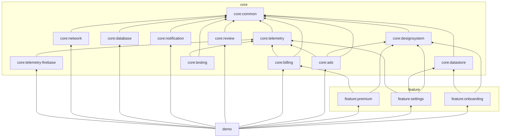
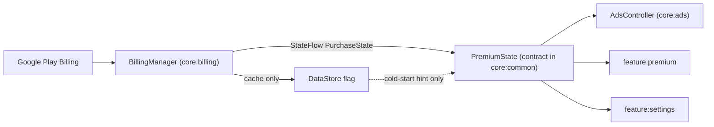

# Android Product Base — Architecture Plan (Phase 1, revision 3)

Status: **APPROVED. Phase 2 (Foundation) implemented; Phases 3–8 pending.**
Date: 2026-08-15
Revision 2 applied the clarified goal (general-purpose starter kit) and decisions Q1–Q7.
Revision 3 applies two approved corrections: `NetworkMonitor` belongs to `core:network`, and
error types are owned by their capability modules rather than by a global hierarchy in `core:common`.

---

## 0. Phase 0 — Environment analysis (facts, not assumptions)

### 0.1 What is in the repository today

```
MyApplication/
├── app/                      # Android Studio "No Activity" template, VIEWS-based (AppCompat + Material Components), no Kotlin source except 2 stub tests
├── gradle/libs.versions.toml # 6 libraries, AGP 9.1.1 only
├── gradle/wrapper/           # Gradle 9.3.1
├── gradle/gradle-daemon-jvm.properties  # toolchainVersion=21, foojay auto-provisioning
├── build.gradle.kts          # applies AGP only
├── settings.gradle.kts       # rootProject.name = "My Application", includes :app
└── local.properties          # sdk.dir (git-ignored ✔)
```

Findings:
- The template is **not Compose** (`appcompat`, `com.google.android.material`). Everything Compose-related is greenfield.
- There is **no Kotlin production source**, no Application class, no Activity, no launcher intent-filter. Nothing to preserve — the `app` module will be replaced outright.
- Namespace `com.example.myapplication` → replaced by `dev.sautao.productbase` (Q4).
- **Not a git repository** → `git init` + hardened `.gitignore` in Phase 2 (Q5).

### 0.2 Toolchain present on this machine

| Item | Value | Note |
|---|---|---|
| OS | macOS 26.5.2, aarch64 | |
| Launcher JVM | OpenJDK 17.0.18 (Homebrew) | on `PATH` |
| Gradle daemon JVM | **Java 21** | from `gradle/gradle-daemon-jvm.properties`, foojay auto-provisioned |
| Android SDK | `~/Library/Android/sdk` | platforms 30–37.2-beta1 (**android-37.0 / 37.1 stable present**), build-tools 34–37 |
| `cmdline-tools` | **empty** | `sdkmanager` unavailable locally; CI provides its own |
| NDK | not installed | not needed |

⚠️ The Homebrew JDK 17 at `/opt/homebrew/Cellar/openjdk@17/17.0.18` is **unusable as a Gradle Java toolchain** ("No class roots are found in the JDK path" — Homebrew's real home is under `libexec/openjdk.jdk/Contents/Home`). `build-logic` must use the **JDK 21** toolchain Gradle already provisions. Recorded so a future agent does not lose an hour to it.

### 0.3 Compatibility spike — measured, not assumed

AGP 9 is a major behaviour-breaking release, so I built a throwaway 3-module project (`app` + `core` library + `build-logic` included build) in the scratchpad and compiled it rather than trusting memory.

| Check | Result |
|---|---|
| AGP 9.3.1 on Gradle 9.3.1 | ❌ **fails** — "Minimum supported Gradle version is 9.5.0" |
| AGP 9.3.1 on Gradle 9.7.0 | ✅ |
| `org.jetbrains.kotlin.android` applied | ❌ **fails** — AGP 9 has *built-in Kotlin*; the plugin is banned |
| AGP-bundled Kotlin 2.2.10 + its KSP 2.2.10-2.0.2 | ❌ **fails** — "Using kotlin.sourceSets DSL is not allowed with built-in Kotlin" |
| Kotlin 2.3.21 (buildscript classpath override) + KSP 2.3.11 | ✅ — matches Google's AGP-9 guidance (KSP ≥ 2.3.6, Hilt ≥ 2.59.2) |
| Compose BOM 2026.08.00 with `compileSdk = 36` | ❌ **fails** — `compose.ui:ui-android:1.12.0` requires **compileSdk 37** |
| `compileSdk = 37`, `targetSdk = 37` | ✅ |
| Compose compiler plugin still applied explicitly | ✅ required — `buildFeatures.compose = true` alone errors |
| Hilt 2.60.1 + KSP, app + library modules | ✅ debug and release |
| Room 2.8.4 + KSP + `androidx.room` plugin (schema export) | ✅ |
| kotlinx-serialization plugin + **type-safe Navigation** (`composable<Route>`, `toRoute()`) | ✅ |
| **Retrofit 3.0.0 + OkHttp 5.4.0 (BOM) + `converter-kotlinx-serialization` 3.0.0 + logging-interceptor** | ✅ debug **and** R8 release |
| **`ConnectivityManager.NetworkCallback` → `callbackFlow` connectivity monitor** | ✅ |
| Play Billing 9.1.0, play-services-ads 25.4.0, UMP 4.0.0, review-ktx 2.0.2 | ✅ compile + R8 |
| `google-services` 4.5.0 + `firebase-crashlytics` 3.0.7 under AGP 9 | ✅ (incl. mapping upload) |
| Core library desugaring 2.1.5 | ✅ |
| **Release build with R8 `isMinifyEnabled = true`** | ✅ **BUILD SUCCESSFUL** |
| Unit tests (JUnit4 + coroutines-test 1.10.2 + Turbine 1.2.1) | ✅ |
| `lintDebug` | ✅ |
| Convention plugins in an included build under AGP 9 | ✅ (with JDK 21 toolchain) |
| Gradle configuration cache ON throughout | ✅ |

Everything below rests on those measured results.

---

## 1. What this repository is

```
Product Base  =  reusable technical capabilities, each independently optional
Product App   =  selected capabilities  +  product-specific domain and features
```

The base is a **general-purpose Android starter kit**, not a foundation tuned to any particular product list. Its job is to cover roughly **80 % of the infrastructure that most Android apps need**, and to make each of those capabilities *droppable* so that no product ships an SDK it does not use.

Three consequences that drive every decision below:

1. **Capability, not product.** The base owns "how to show an ad" and "how to call an HTTP API". It never owns "how to compute a savings streak". No product domain, ever, in `core`.
2. **Optional by construction.** Optionality is enforced by *module boundaries*, not by documentation or runtime flags. If a capability cannot be removed by deleting one line from `settings.gradle.kts` and one dependency, it is not optional.
3. **Deliberately incomplete.** Camera, Maps, Location, BLE, media, ML, widgets, chat and friends are **out of scope for v1** and become optional extension modules only when a real product needs them. Chasing 100 % coverage is how starter kits rot.

### 1.1 Design rules, in priority order

1. Reuse infrastructure, never products.
2. A module exists to make a dependency optional or to enforce a boundary — not to express a taxonomy.
3. No abstraction without a second implementation or a test that needs a fake.
4. Compile-time configuration over runtime configuration.
5. Optimise for a reader with zero context — usually an AI agent with a fresh window.

---

## 2. Capability catalogue — Base v1 vs future extensions

### 2.1 In Base v1

| Capability | Module | Optional? | External SDK pulled in |
|---|---|---|---|
| Kotlin/coroutine primitives, `DispatcherProvider`, `TimeProvider`, `UiText`, `Logger`, `AppConfig`, `PremiumState`, locale-aware formatters | `core:common` | always present | none (framework only) |
| Material 3 design system, theming, components | `core:designsystem` | yes (headless/service apps) | Compose |
| Typed key–value preferences | `core:datastore` | yes | DataStore |
| Local relational persistence | `core:database` | yes | Room |
| **HTTP / REST client** | `core:network` | yes | OkHttp, Retrofit, kotlinx-serialization |
| Analytics + crash-reporting **contracts** | `core:telemetry` | yes | none |
| Firebase implementations of those contracts | `core:telemetry-firebase` | yes | Firebase Analytics + Crashlytics |
| Advertising + consent (UMP) | `core:ads` | yes | Google Mobile Ads, UMP |
| In-app purchases | `core:billing` | yes | Play Billing |
| In-app review prompt | `core:review` | yes | Play Review |
| Local notifications, channels, scheduled reminders | `core:notification` | yes | WorkManager |
| Fakes + test rules | `core:testing` | test-only | none |
| Onboarding flow mechanism | `feature:onboarding` | yes | — |
| Settings screen mechanism | `feature:settings` | yes | — |
| Premium/paywall screen | `feature:premium` | yes (requires `core:billing`) | — |

### 2.2 Explicitly NOT in v1 — future optional extension modules

Camera · Maps · Location/Geofencing · Bluetooth/BLE · Wi-Fi Direct · Media playback · WebSocket/realtime · Firebase Auth · Google Sign-In · any other auth or OAuth · ML/on-device inference · Glance widgets · WebRTC · chat · in-app updates (`core:appupdate`) · Remote Config · background **sync engine** · pagination framework · image loading (see below) · data export/CSV · biometric auth · deep-link routing framework.

Each becomes a module the day a real product needs it, following the same rules. They are named here so an agent can see the intended growth path instead of inventing one.

**Image loading (Coil) — a deliberate borderline call.** It is common enough to belong in a starter kit, but adding it to `core:designsystem` would force ~300 KB and an image pipeline onto every offline app. Resolution: Coil is **pinned in the version catalog** (`libs.coil.compose`) with a documented one-line recipe, but is **not a module and not a dependency of anything**. A product that needs it adds one line. This is the pattern for any "one dependency, no wrapper needed" capability.

### 2.3 Things inside the network boundary that are explicitly excluded

Per your instruction: **no** authentication implementation, token refresh, OAuth, WebSocket, pagination framework, sync engine, or generic `ApiResponse<T>` hierarchy. `core:network` provides a configured client and error mapping; the API surface, DTOs, and auth belong to the product or to a future extension.

---

## 3. Revised module structure

**17 Gradle projects.**

```
android-product-base/                       (rootProject; group dev.sautao.productbase)
├── build-logic/                            included build — convention plugins
├── demo/                                   the one demo shell (Q6) — verification only, never a product
├── core/
│   ├── common/                             ⬤ foundation, zero third-party SDKs
│   ├── designsystem/                       ○ Compose M3 system
│   ├── datastore/                          ○ typed preferences
│   ├── database/                           ○ Room infrastructure — NO entities (Q: kept out per your instruction)
│   ├── network/                            ○ OkHttp + Retrofit + kotlinx-serialization   ← NEW in v1 (Q2)
│   ├── telemetry/                          ○ Analytics + CrashReporter contracts + NoOp
│   ├── telemetry-firebase/                 ○ the ONLY module that sees Firebase
│   ├── ads/                                ○ AdMob + UMP consent
│   ├── billing/                            ○ Play Billing
│   ├── review/                             ○ Play In-App Review
│   ├── notification/                       ○ channels, permission, WorkManager scheduling
│   └── testing/                            ⬤ test-only fakes and rules
└── feature/
    ├── onboarding/                         ○
    ├── settings/                           ○
    └── premium/                            ○ requires core:billing
```

Naming: Gradle path `:core:network` → artifactId `core-network`, group `dev.sautao.productbase`, package `dev.sautao.productbase.core.network`. This alignment is what makes future Maven publishing a configuration change rather than a refactor (§8).

### 3.1 Why `demo/` and not `app/`

In a standalone base repo there is no "the app". Calling it `:demo` tells every human and agent that product features must never be built there. It also keeps the door open for a second sample later without a confusing rename.

### 3.2 Module responsibilities

| Module | Contents | Why it is its own module |
|---|---|---|
| `core:common` | `DispatcherProvider`, `TimeProvider`/`Clock`, `UiText`, `Logger`, `AppConfig` + `FeatureFlags` contracts, `PremiumState` contract, locale-aware number/currency/date formatters, small coroutine/Flow helpers. **No global error hierarchy** (§3.4) and **no connectivity monitoring** (§4.3). | The only universally-present module. Its dependency-freedom — and its smallness — is what makes everything else optional. |
| `core:designsystem` | M3 theme (light/dark/system + dynamic colour), colour/typography/shape/spacing tokens, the 13 components from the brief, a11y defaults | Isolates the Compose UI vocabulary; products re-brand by overriding tokens. |
| `core:datastore` | `AppPreferences`: theme mode, onboarding completed, notifications enabled, analytics opt-in, cached entitlement | Single owner of preference keys — prevents collisions across features. |
| `core:database` | Room `TypeConverter`s (`Instant`, `LocalDate`, `LocalTime`, `ZoneId`), shared builder config (WAL, **destructive migration banned**), migration-test helper. **No entities — sample entities live in `demo`.** | Centralises Room + KSP + schema-export wiring and the migration policy. |
| `core:network` | `NetworkConfig` (base URL, timeouts, debug logging flag), `OkHttpClient`/`Retrofit`/`Json` factories, debug-only `HttpLoggingInterceptor`, `NetworkError` + mapping, `NetworkMonitor` (ConnectivityManager → Flow), Hilt module with `@Provides` overridable per product | Owns Retrofit/OkHttp so offline apps ship neither; owns connectivity because connectivity is a networking concern. |
| `core:telemetry` | `Analytics`, `CrashReporter`, sealed `AnalyticsEvent` catalogue, `NoOp*` implementations | **Contracts only, no Firebase dependency** — the boundary that makes Firebase optional graph-wide. |
| `core:telemetry-firebase` | `FirebaseAnalyticsClient`, `CrashlyticsReporter`, Hilt bindings | The only place Firebase types may appear. |
| `core:ads` | `AdsController`, banner/interstitial/rewarded in base-owned types, `@Composable AppBannerAd`, interstitial frequency governor, **UMP consent flow** | Owns the GMA SDK; product code never imports `com.google.android.gms.ads.*`. |
| `core:billing` | `BillingManager`, `PurchaseState`, `AppProduct`, connection/retry, acknowledgement, restore; publishes `PremiumState` | Owns Play Billing; the `PremiumState` seam keeps `core:ads` independent of it. |
| `core:review` | `AppReviewManager` interface + Play implementation + NoOp; products decide *when* to ask | Play Review is a separate SDK; review prompts are triggered from product code, not from settings UI. |
| `core:notification` | Channel registry, `POST_NOTIFICATIONS` permission helper, `ReminderScheduler` (WorkManager), cancellation, deep-link `PendingIntent` builder with immutable flags | Self-contained; pulls WorkManager, which many apps do not need. |
| `core:testing` | `MainDispatcherRule`, `TestDispatcherProvider`, `FixedTimeProvider`, `FakeAnalytics`, `FakeCrashReporter`, `FakeAdsController`, `FakeBillingManager`, `FakeReviewManager`, in-memory Room helper, MockWebServer helper | Shared fakes need one importable home. |
| `feature:onboarding` | Pager flow driven by a **product-supplied** `List<OnboardingPage>`; next/skip/finish; completion persisted | Mechanism reusable, content product-owned. |
| `feature:settings` | Settings screen assembled from a **product-supplied** list of entries | "Only show what exists" holds by construction. |
| `feature:premium` | Benefits, product/price display, purchase, restore, entitlement state | UI talks to `BillingManager`, never `BillingClient`. |
| `demo` | Single Activity, NavHost, theme switching, onboarding, settings, premium, sample Room entity + migration, sample reminder, banner ad slot, sample Retrofit service against MockWebServer/httpbin-style config | Infrastructure verification, and the only consumer that exercises the module APIs. |

### 3.3 Modules from the original brief still rejected

`core:model` (no domain in the base) · `core:ui` separate from `core:designsystem` (doubles module count, zero isolation gain; `UiText` sits in `core:common` so ViewModels need no UI dependency) · `core:config` (one interface is not a module) · `core:consent` (exists only because of ads; lives in `core:ads`) · `core:connectivity` (explicitly rejected — connectivity lives in `core:network`, §4.3) · analytics/crashreporting as four separate modules (contract-vs-implementation split achieves the same boundary with half the modules).

### 3.4 Error ownership — no global error hierarchy

**Errors belong to the capability that produces them.** `core:common` does **not** define a sealed hierarchy enumerating `Network`, `Database`, `Billing`, `Firebase`, `Camera`, `Bluetooth`, … — that type would have to be edited every time a capability is added, which is the exact coupling the module boundaries exist to prevent, and it would drag network/database/billing vocabulary into modules that link none of those SDKs.

| Owner | Type |
|---|---|
| `core:network` | `NetworkError` (no connection, timeout, HTTP status, malformed payload) |
| `core:database` | `DatabaseError` — **only if implementation proves it is needed**; Room already throws meaningful exceptions |
| `core:billing` | `BillingError` (user cancelled, unavailable, already owned, service disconnected, …) |
| future capability modules | their own error type, same rule |

The UI/product layer maps whichever errors it actually encounters to `UiText`. A product that uses two capabilities handles two error types; a product that uses one handles one. Nothing forces it to know about the rest.

`core:common` may hold at most a **tiny generic** error type (`Validation`, `Unexpected`) — and only once implementation demonstrates a real need shared across capabilities. It is not created speculatively; if Phase 3+ never needs it, it never exists.

---

## 4. Where `core:network` fits

### 4.1 Position in the graph

`core:network` is a **leaf capability**: nothing else in the base depends on it, and `demo` is its only consumer. Deleting it from `settings.gradle.kts` breaks nothing but `demo`.

It owns `NetworkError` itself (§3.4) — there is no global `AppError` in `core:common` to depend on. Its only base dependency is `core:common`, and only for `Logger`, which `NetworkMonitor` uses when the platform refuses a connectivity callback.

Deliberately **not** connected to:
- `core:telemetry` — network failures are mapped to `NetworkError`; whether they get reported is the caller's decision.
- `core:database` — no caching or sync layer in the base. That is a product concern (or a future `core:sync` extension born from a real requirement).

### 4.2 What it contains (target: ~8 files)

```kotlin
// public surface, product-facing
data class NetworkConfig(
    val baseUrl: String,
    val connectTimeout: Duration = 15.seconds,
    val readTimeout: Duration = 20.seconds,
    val writeTimeout: Duration = 20.seconds,
    val enableHttpLogging: Boolean = false,   // wired to BuildConfig.DEBUG by the product
)

sealed interface NetworkError {            // owned here, not in core:common (§3.4)
    data object NoConnection : NetworkError
    data object Timeout : NetworkError
    data class Http(val code: Int) : NetworkError
    data object Malformed : NetworkError
    data class Unexpected(val cause: Throwable) : NetworkError
}

fun Throwable.toNetworkError(): NetworkError
```
Plus Hilt `@Provides` for `Json`, `OkHttpClient`, `Retrofit` — each `@Provides` marked so a product can replace it, and the retrofit builder exposed as a function so a product with two APIs can build a second instance without fighting DI.

**Release safety**: the logging interceptor is added only when `enableHttpLogging` is true, and the demo wires that to `BuildConfig.DEBUG`, so a release build cannot log bodies. Cleartext traffic is off (`usesCleartextTraffic` unset, `networkSecurityConfig` documented). No custom trust managers, no certificate pinning by default (pinning without a rotation plan is an outage waiting to happen — documented as a product decision).

### 4.3 Connectivity monitoring — in `core:network`

`NetworkMonitor` (ConnectivityManager → `Flow<Boolean>`, verified as a `callbackFlow` in the spike) lives in **`core:network`**.

Revision 2 had placed it in `core:common` on the grounds that it needs no third-party dependency. That reasoning is rejected: **connectivity monitoring is semantically a networking capability**, and `core:common` is kept as small and universally applicable as possible — "it happens to have no dependencies" is not a reason to put something there. A `core:connectivity` module is explicitly **not** created; splitting one file into its own project is module explosion.

Consequence, accepted: an offline-first app that wants an "you're offline" banner includes `core:network`, and therefore links OkHttp/Retrofit, without calling an API. If a real product ever hits that combination and the size matters, the answer is to revisit *then* — not to pre-emptively distort `core:common`.

---

## 5. Updated dependency graph



### 5.1 Enforced rules

1. `core:common` depends on **no other project** and on no third-party SDK.
2. **No `feature → feature` edge, ever.** Cross-feature navigation is a lambda wired by the product (`SettingsScreen(onNavigateToPremium = …)`).
3. **`core:ads` must not depend on `core:billing`.** Both meet at `PremiumState` in `core:common`; billing provides the real binding, ad-supported-free apps bind `PremiumState.AlwaysFree`. (Kept per your instruction.)
4. SDK containment: Firebase only in `core:telemetry-firebase`; GMA only in `core:ads`; Play Billing only in `core:billing`; Play Review only in `core:review`; Retrofit/OkHttp only in `core:network`; Room only in `core:database`. Enforced by a CI import check plus `MODULES.md` forbidden-dependency lists.
5. `core` never depends on `feature`; `feature` never depends on `demo`.
6. No cycles (follows from 1–5).

### 5.2 The one edge worth defending

`core:ads → core:designsystem`: the banner is a Composable that must respect app theming. Acceptable because `core:designsystem` is dependency-light and present in any app that shows ads. If it ever bites, the banner moves behind a slot API.

### 5.3 Composition examples (these become the core of `NEW_APP_GUIDE.md`)

| Product shape | Modules included |
|---|---|
| Offline tracker | `common` + `designsystem` + `datastore` + `database` + `notification` |
| API-backed app | `common` + `designsystem` + `datastore` + `network` |
| Ad-supported utility | `common` + `designsystem` + `ads` (+ `telemetry` + `telemetry-firebase`) |
| Premium app | `common` + `designsystem` + `ads` + `billing` + `feature:premium` |
| Full-fat product | any combination above + `onboarding` + `settings` + `review` |

A product includes only what it lists. Nothing in the base forces the rest.

---

## 6. Technology and version decisions

Every row below compiled successfully in the spike (§0.3).

| Component | Version | Rationale |
|---|---|---|
| Gradle | **9.7.0** | AGP 9.3.1 requires ≥ 9.5.0 (measured); 9.7.0 is current stable. Wrapper bumped from 9.3.1 with checksum. |
| Android Gradle Plugin | **9.3.1** | Latest stable (9.4.0 is alpha). The repo is already on AGP 9. |
| Kotlin | **2.3.21** | Overrides AGP's bundled KGP 2.2.10 via `buildscript { classpath(…) }` — **required**, since AGP 9 needs KSP ≥ 2.3.6 and 2.2.10's KSP cannot run under built-in Kotlin. 2.4.x has no matching stable KSP. |
| KSP | **2.3.11** | Aligned with Kotlin 2.3.x. |
| Hilt | **2.60.1** | Google requires ≥ 2.59.2 with AGP 9. |
| Compose BOM | **2026.08.00** | compose 1.12.0, material3 1.4.0 (stable). |
| compileSdk / targetSdk | **37 / 37** | Compose 1.12.0 *requires* compileSdk 37 (measured); android-37 installed. |
| **minSdk** | **26** (Q1) | Removes all notification-channel and adaptive-icon branching; native `java.time`. |
| JDK | source/target **17**; toolchain **21** for `build-logic` | AGP 9 requires JDK 17+; daemon already runs 21. |
| Core library desugaring | `desugar_jdk_libs` **2.1.5** — **kept despite minSdk 26** | Not for `java.time` availability (native at 26) but for **bundled, up-to-date tzdata**: desugared `java.time` carries its own timezone rules instead of relying on a stale device database. For any date/reminder-driven app that is a correctness issue, and it costs one line plus a small dex delta. |
| Room | **2.8.4** + `androidx.room` plugin 2.8.4 | Declarative `schemaDirectory` for migration tests. |
| DataStore | **1.2.1** | Latest stable (1.3.0 is alpha). |
| Navigation Compose | **2.9.8** + kotlinx-serialization 1.11.0 | Type-safe routes verified. Navigation 3 rejected — too new for a foundation. |
| Lifecycle / Activity Compose | **2.11.0** / **1.13.0** | |
| WorkManager | **2.11.2** + `androidx.hilt:hilt-work` 1.4.0 | 2.12.0 is rc. |
| Coroutines | **1.10.2** | Boring and well-worn; 1.11.0 offers nothing we need. |
| **OkHttp** | **5.4.0** (via `okhttp-bom`) | BOM pins `logging-interceptor` and `mockwebserver3-junit4` together. Overrides Retrofit's transitive OkHttp 4.12.0. |
| **Retrofit** | **3.0.0** + `converter-kotlinx-serialization` 3.0.0 | First-party serialization converter — no third-party converter needed. |
| kotlinx-serialization | **1.11.0** | Also used by type-safe Navigation. |
| Firebase BOM / plugins | **34.17.0** / google-services **4.5.0** / crashlytics **3.0.7** | Analytics + Crashlytics only. |
| Play Billing | **9.1.0** (`billing-ktx`) | |
| AdMob / UMP | `play-services-ads` **25.4.0** / **4.0.0** | |
| In-App Review | `review-ktx` **2.0.2** | |
| Coil (catalog only, no module) | **3.5.0** | Recipe, not a dependency. |
| Testing | JUnit4 4.13.2, coroutines-test 1.10.2, Turbine 1.2.1, `room-testing`, `compose-ui-test-junit4`, `mockwebserver3-junit4` | |
| Quality | Android Lint + **Spotless with ktlint 1.8.0** (Q7) | detekt excluded in v1: 1.23.8 is Kotlin-1.9-era, 2.0 is alpha. |

### 6.1 AGP 9 facts that go verbatim into `AI_RULES.md`

1. **Never apply `org.jetbrains.kotlin.android`** — AGP 9 compiles Kotlin itself; applying it is a hard failure.
2. Kotlin options live in a **top-level `kotlin { compilerOptions { … } }`**, not `android.kotlinOptions`.
3. The **Compose compiler plugin is still applied explicitly**; `buildFeatures.compose = true` alone fails.
4. `buildConfig` is **off by default** — enable per module.
5. `kapt` is incompatible with built-in Kotlin. **KSP only.**
6. Old variant APIs are gone → `androidComponents.onVariants/beforeVariants`.
7. Third-party Gradle plugins are the main AGP-9 hazard. Keep the plugin surface minimal.

---

## 7. Convention plugins (`build-logic`)

| Plugin id | Applies |
|---|---|
| `productbase.android.application` | AGP app, sdk levels, Java 17, desugaring, debug/release build types, R8 + resource shrinking on release, lint config |
| `productbase.android.library` | AGP library + shared config + `resourcePrefix` + default test deps |
| `productbase.android.compose` | Compose compiler plugin, `buildFeatures.compose`, Compose BOM + ui/material3/tooling |
| `productbase.android.hilt` | KSP, Hilt plugin, hilt-android + compiler |
| `productbase.android.room` | KSP, `androidx.room` plugin, `schemaDirectory`, room runtime/ktx/compiler |
| `productbase.android.feature` | library + compose + hilt + `core:common` + `core:designsystem` + navigation + lifecycle |

Rules: no version literals anywhere (catalog only); `build-logic` uses the **JDK 21** toolchain; `resourcePrefix` per library module (e.g. `pb_ds_`) so published artifacts cannot collide on resource names.

---

## 8. Standalone repo, publish-ready (Q3)

The base is its own repository. Products live in their own repositories and, **for now**, consume the base via a Gradle **composite build**:

```kotlin
// product/settings.gradle.kts
includeBuild("../android-product-base")
```
with dependency substitution mapping `dev.sautao.productbase:core-designsystem` → `:core:designsystem`. That means product build files already reference **artifact coordinates**, so switching to real Maven artifacts later is a one-line change in the product, not a refactor.

Publishing is **not implemented in v1**, but these constraints are honoured now so it stays cheap:

- `group = dev.sautao.productbase`, artifactId mirrors the Gradle path (`core-network`), single `version` property in `gradle.properties` (`0.1.0-SNAPSHOT`).
- No module reads the product's `BuildConfig`; configuration arrives via injected `AppConfig`/`NetworkConfig`/`AdsConfig`.
- `resourcePrefix` on every library module; no `strings.xml` key collisions.
- Public API kept deliberately small and documented in `MODULES.md`. Kotlin `explicitApi()` is **deferred** — it adds annotation friction for AI agents; revisit when APIs stabilise and publishing actually starts.
- `api()` vs `implementation()` chosen consciously (only `core:common` types leak through public signatures).

---

## 9. Configuration, feature flags, monetisation, and the rest

### 9.1 Configuration

| Value | Location | Committed? |
|---|---|---|
| `applicationId`, versions, app name | product `app/build.gradle.kts` + `strings.xml` | ✅ |
| Privacy/terms URLs, support email | `BuildConfig` | ✅ |
| `adsEnabled`, `billingEnabled`, `analyticsEnabled`, `crashReportingEnabled`, `notificationsEnabled`, `networkEnabled` | `BuildConfig` booleans **and** module inclusion | ✅ |
| API base URL (per build type) | `BuildConfig` → `NetworkConfig` | ✅ if not secret |
| **Debug** AdMob IDs | Google's official **test** IDs, hardcoded in `core:ads` | ✅ (public) |
| **Release** AdMob app ID + unit IDs | `local.properties` / CI env → manifest placeholder + `BuildConfig` | ❌ never |
| Billing product IDs | `BuildConfig` | ✅ (not secret) |
| Keystore + passwords | `keystore.properties`, git-ignored / CI secrets | ❌ never |
| `google-services.json` | git-ignored; Firebase plugins applied **only if the file exists** | ❌ never |

`AppConfig` + `FeatureFlags` are interfaces in `core:common`; the product's app module provides the single implementation reading `BuildConfig`. Nothing else touches `BuildConfig`.

A fresh clone with no secrets must still build and run: no `google-services.json` → Firebase plugins skipped → telemetry falls back to NoOp; missing release ad IDs → release build fails a checklist item loudly rather than silently shipping test ads.

> Per the brief: **any secret inside an APK is extractable.** Externalising IDs is hygiene and rotation, not secrecy.

### 9.2 Monetisation



- **Play is authoritative.** DataStore caches the last known entitlement only so the first frame after cold start does not flash ads at a paying user; refreshed on start and resume, and a refresh saying "not owned" wins.
- `PurchaseState` = `Unknown / NotPurchased / Pending / Purchased`. Pending is surfaced, never treated as owned; acknowledgement handled inside the window.
- Lifetime one-time Pro first; `AppProduct` carries a type so subscriptions slot in without redesign.
- **Consent before personalised ads**: UMP resolved at startup before GMA initialisation; non-personalised requests where required; consent logic never touches business UI.
- Interstitials pass through a frequency governor (min interval + min actions), conservative defaults. No aggressive placements.

### 9.3 State, threading, errors, time

Immutable `data class XUiState` per screen → `StateFlow` → `collectAsStateWithLifecycle()`. No universal `UiState<T>`. One-off events via `Channel`→`Flow` only when state cannot express them. `DispatcherProvider` injected; suspend functions main-safe; no IO on Main. Errors are **capability-owned** (§3.4) and mapped to `UiText` at the UI layer — raw exception text never reaches users; genuinely unexpected failures reach `CrashReporter`; never a silent `catch`. `TimeProvider` wraps `java.time.Clock`; business logic never calls `Instant.now()` directly; timezone explicit at every date boundary.

### 9.4 Testing and CI

ViewModel state transitions (coroutines-test + Turbine) · `AppPreferences` round-trips · Room DAO tests + **at least one real migration test** against exported schemas · `core:network` error mapping against **MockWebServer** · billing state machine against `FakeBillingManager` · interstitial frequency governor (pure logic, high bug density) · 2–3 Compose UI tests including a11y semantics. Fakes live in `core:testing`.

CI (GitHub Actions, on PR, JDK 21, Gradle cache): `./gradlew spotlessCheck lint test assembleDebug`. No emulator tests in v1; documented as a later addition alongside Firebase App Distribution / Play internal track.

---

## 10. Abstractions I am NOT creating

`BaseActivity` · `BaseFragment` · `BaseViewModel` · `BaseRepository` · `BaseUseCase` · generic `UseCase<In, Out>` · generic `UiState<T>` · generic `Resource<T>` · generic `ApiResponse<T>` · **a global `AppError` hierarchy enumerating every capability's failures (§3.4)** · `SyncEngine` · MVI framework · `NavigationManager` singleton · a DI wrapper over Hilt · repositories that merely rename DAO methods · Firebase Auth/Firestore/RTDB/Functions · Remote Config · remote feature flags · `core:model` / `core:ui` / `core:config` / `core:consent`.

Each is listed in `AI_RULES.md` so an agent reaching for one must argue against a written decision instead of silently "improving" the codebase.

---

## 11. What changed because the goal is a general-purpose starter kit

This is the section you asked for — the honest delta from revision 1, which had been reasoned from the eleven candidate products.

| # | Change | Why the goal change forced it |
|---|---|---|
| 1 | **`core:network` is in v1** (was: deferred) | Rev 1 deferred it because ten of eleven candidate apps were offline. Under "general-purpose starter kit", HTTP is table-stakes infrastructure and its absence would be the first thing every new product had to hand-roll — differently each time. Kept minimal and leaf-shaped so offline apps pay nothing. |
| 2 | **`NetworkMonitor` placed in `core:network`** (rev 3 correction — rev 2 had it in `core:common`) | Connectivity is semantically a networking capability. `core:common` is kept minimal and universally applicable; "needs no third-party dependency" is not sufficient reason to live there. No `core:connectivity` module. |
| 3 | **`core:review` added as a module** (was: folded into settings) | Rev 1 could assume review prompts belonged near settings. A general kit must let *any* product trigger a review at *any* moment without importing a settings UI — and Play Review is a separate SDK that must stay droppable. |
| 4 | **Coil admitted to the catalog but refused as a module** | New question raised by the broader goal ("shouldn't a starter kit do images?"). Answer: yes to availability, no to coupling. This establishes the general pattern for one-dependency capabilities. |
| 5 | **An explicit non-goals list (§2.2)** | With a product-specific goal, "not building camera" was obvious. With a general goal, scope creep is the main failure mode, so the boundary is now written down with a named growth path. |
| 6 | **Publish-readiness constraints adopted now** (artifact-shaped naming, `resourcePrefix`, single version property, no `BuildConfig` reads in core, composite-build consumption via artifact coordinates) | Rev 1's recommendation was a git submodule, which tolerates sloppy coordinates. Versioned artifacts do not. These constraints cost nothing today and prevent a rename-everything refactor later. |
| 7 | **`app` → `demo`** | With products in separate repos, the shell is a test harness, not an app. The name is the cheapest defence against product code landing in the base. |
| 8 | **Feature flags gained `networkEnabled`; capability matrix became a first-class artifact (§2.1, §5.3)** | The kit's primary UX is *choosing capabilities*. `NEW_APP_GUIDE.md` is now organised around that selection step. |
| 9 | **Desugaring kept even at minSdk 26** | Re-examined under the new goal: a general kit will be used by date-heavy apps on old devices, where bundled tzdata is a correctness matter, not a compatibility one. |
| 11 | **Global `AppError` hierarchy dropped; errors owned by capability modules** (rev 3 correction) | A sealed type in `core:common` enumerating Network/Database/Billing/Camera/… would need editing every time a capability is added — the precise coupling the module boundaries exist to prevent — and would push SDK vocabulary into modules that link none of it. See §3.4. |
| 10 | **`core:database`'s justification strengthened** | Rev 1 called it the weakest module and set a trigger to delete it. As a general kit, local persistence is a headline capability and Room deserves a first-class, permanently-owned wiring point. The "collapse it" trigger is withdrawn; the "no entities in it" rule stands (your instruction). |

**Decisions that did *not* change, and why they survived re-examination**: the `PremiumState` seam (your instruction, and it is what keeps ads free of billing); contract-vs-implementation split for telemetry; no `core:model`/`core:ui`; no UseCase layer; MVVM + StateFlow; type-safe Navigation; one demo shell; Lint + Spotless without detekt.

---

## 12. Self-critique

| Suspect | Honest assessment | Trigger to collapse it |
|---|---|---|
| `core:telemetry` split in two | Earns its keep — the only reason an offline app links zero Firebase. | Never, unless Firebase becomes mandatory. |
| `PremiumState` in `core:common` | The most "clever" thing here. Justified: without it, every ad-supported free app links Play Billing. | If every product ships billing anyway, delete it and let `core:ads` depend on `core:billing`. |
| `core:review` (~4 files) | Thin. Justified only by SDK optionality. | If a `core:appupdate` appears, merge both into `core:playstore`. |
| `core:network` with no first consumer | Accepted risk you took knowingly. Mitigated by keeping it tiny and refusing auth/sync/pagination. | If after two products it is still untouched, it costs nothing — it is a leaf. |
| 17 modules | Near the upper bound of what one developer should carry. Justified only because each removes an SDK from someone's APK. | Any new module must name the SDK it makes optional. |
| 6 convention plugins | Right for 17 modules. | Merge any two that are always applied together. |
| Type-safe navigation via a compiler plugin in every feature module | Verified working; alternative (string routes) is the thing AI agents get wrong most. | None. |

### 12.1 What will actually hurt over time

1. **AGP 9 churn** — AGP 10 (mid-2026) removes the `newDsl`/`builtInKotlin` escape hatches. *Mitigation:* the base already uses the new model and a minimal plugin surface.
2. **Version-drift across products** once several exist. *Mitigation:* composite build today, artifact coordinates from day one, publishing when APIs settle.
3. **Play policy drift** (billing, consent, data safety) hitting every product at once. *Mitigation:* each is one module with fakes; a fix is one module + one version bump.
4. **Google Play portfolio risk** if many apps ship from one base. *Mitigation:* `RELEASE_CHECKLIST.md` requires a written differentiation statement per app; the base ships no consumer brand, no reusable store copy, no default icon beyond a neutral placeholder.
5. **Migration mistakes at scale.** *Mitigation:* destructive migration banned in release config; schemas exported and committed; one migration test mandatory.
6. **Over-abstraction creep by future agents.** *Mitigation:* `AI_RULES.md` prohibition list (§10) plus per-module forbidden-dependency lists.

---

## 13. Decisions locked

| # | Decision |
|---|---|
| Q1 | `minSdk = 26` |
| Q2 | `core:network` in v1, minimal and optional; no auth/token refresh/OAuth/WebSocket/pagination/sync/`ApiResponse` hierarchy |
| Q3 | Standalone repository; artifact-shaped module naming; composite-build consumption now; Maven publishing deferred until APIs stabilise |
| Q4 | Namespace / group: `dev.sautao.productbase` |
| Q5 | `git init` + hardened `.gitignore` in Phase 2 |
| Q6 | One demo shell (named `demo`) |
| Q7 | Android Lint + Spotless/ktlint; no detekt in v1 |
| — | `PremiumState` retained to keep Ads and Billing independent |
| — | Sample/demo Room entities live in `demo`, never in `core:database` |

### 13.1 Three small things I decided myself (say the word if you disagree)

1. **Demo shell module named `demo`, not `app`** (§3.1).
2. **Core library desugaring kept at minSdk 26** for bundled tzdata (§6).
3. **Coil pinned in the catalog but not wired into any module** (§2.2).

---

## 14. Risks

| Risk | Severity | Mitigation |
|---|---|---|
| Repository not under version control | 🔴 | `git init` before any code (Q5) |
| AGP 9 / built-in Kotlin is young; third-party plugins break | 🟠 | Minimal plugin surface; every plugin compile-verified in the spike; detekt/Paparazzi excluded |
| AGP 10 removes `newDsl` / `builtInKotlin` opt-outs | 🟠 | Base already on the new model |
| Kotlin 2.3.21 override of AGP's bundled 2.2.10 could break on an AGP patch bump | 🟠 | Pinned + documented; CI catches it |
| Compose 1.12 forces compileSdk 37 (very new platform) | 🟡 | android-37 installed; targetSdk 37 is where Play is heading |
| `core:network` ships without a real consumer shaping it | 🟡 | Kept tiny and leaf-shaped; excluded features listed explicitly |
| OkHttp 5 overriding Retrofit 3's transitive OkHttp 4.12.0 | 🟡 | BOM-pinned; verified compiling and passing R8 |
| Billing 9.x / AdMob 25.x differ from the tutorials agents were trained on | 🟡 | Thin documented wrappers + fakes; agents work against our API |
| Play portfolio / spam risk | 🟠 | Differentiation gate in `RELEASE_CHECKLIST.md` |
| Over-abstraction creep | 🟡 | `AI_RULES.md` prohibition list |

---

## 15. Implementation phases

| Phase | Scope | Exit criteria |
|---|---|---|
| **2 — Foundation** | `git init` + `.gitignore`; wrapper → 9.7.0; catalog; `build-logic`; `core:common`; `core:designsystem`; `core:datastore`; Hilt; single-Activity NavHost; `demo` skeleton | `assembleDebug` + `test` + `lint` + `spotlessCheck` green |
| **3 — Data & infrastructure** | `core:database` (+ sample entity **in `demo`**, exported schema, migration test); `core:network` (+ MockWebServer tests); `core:telemetry`; `core:telemetry-firebase`; `core:notification` | above + DAO/migration/preferences/network-error tests green |
| **4 — Monetisation** | `core:ads` (UMP consent, frequency governor); `core:billing`; `feature:premium` | above + billing/frequency tests; release build green |
| **5 — Common features** | `feature:onboarding`; `feature:settings`; theme switching; `core:review`; share | above + ViewModel tests |
| **6 — Quality** | Compose tests; R8 rules; release build; Spotless; CI workflow; import-boundary check | full verification green on a clean clone |
| **7 — Documentation** | README, ARCHITECTURE, AI_RULES, MODULES, NEW_APP_GUIDE (capability-selection first), RELEASE_CHECKLIST | docs verified against actual code |
| **8 — Adversarial review** | Fresh-eyes review; 🔴/🟠/🟡/🟢 classification; fix all 🔴 and all 🟠 without a written waiver | re-verification green |

---

## 16. Definition of Done (v1.0)

Fresh clone builds · demo runs · release (R8) builds · tests pass · lint + spotless pass · no secrets in repo · debug uses official test ad IDs · production config externalised · Billing Play-ready · **Firebase, Network, Ads, Billing, Room, Notifications, Review each provably droppable** · zero product-specific business logic in `core` · module boundaries documented with allowed/forbidden dependency lists · `AI_RULES.md` · `NEW_APP_GUIDE.md` organised around capability selection · `RELEASE_CHECKLIST.md` with a differentiation gate · no unjustified abstraction · a fresh AI agent can work in the repo with no undocumented context.

---

---

## 17. Phase 2 outcome (implemented)

### 17.1 What was built

`build-logic` (4 convention plugins) · `core:common` · `core:designsystem` · `core:datastore` · `demo`.
Verified with `spotlessCheck`, `lint`, `test`, `assembleDebug` from a clean build, plus a release
build through R8 and a run on an API 36 emulator (theme choice survived a force-stop, confirming
the DataStore path end to end).

### 17.2 Planned abstractions deliberately NOT implemented

Per the standing instruction not to build an abstraction before it has a use, these were dropped
from Phase 2 and will appear in the phase that first needs them:

| Abstraction | Why not yet | Expected phase |
|---|---|---|
| `DispatcherProvider` | Nothing in Phase 2 does its own IO — DataStore is already main-safe | 3 (`core:database`, `core:network`) |
| `TimeProvider` / `Clock` | No time-dependent logic exists yet | 3 |
| `UiText` | No ViewModel yet produces user-facing text; screens read string resources directly | 3 or 5 |
| `AppConfig` / `FeatureFlags` | No capability is configurable yet; the demo needs no product configuration | 3 |
| `PremiumState` | Meaningless before ads or billing exist | 4 |
| `core:testing` module | `MainDispatcherRule` and `FakeAppPreferences` have exactly one consumer each and live in `demo/src/test` | 3, when a second module needs them |
| `productbase.android.room` / `.feature` convention plugins | No Room module and no feature module yet | 3 and 5 |
| Locale-aware formatters | Nothing formats a number, currency or date yet | 3 |

### 17.3 AGP 9 findings that changed the implementation

1. **`CommonExtension` exposes nested DSL objects as properties only** — the `defaultConfig { }`,
   `compileOptions { }` and `lint { }` block forms live on the concrete `ApplicationExtension` /
   `LibraryExtension` types. Shared convention-plugin code must use property access
   (`defaultConfig.minSdk = …`). Kotlin reports this as a confusing cascade of "Unresolved
   reference" errors on the *inner* members.
2. **The `Lint` DSL type moved to `com.android.tools.build:gradle-common-api`**, which is not on
   the classpath via `com.android.tools.build:gradle` alone; `build-logic` declares it explicitly.
3. `src/main/kotlin` is registered by built-in Kotlin without extra configuration, and an Android
   library needs no `AndroidManifest.xml` when its namespace is set in the build file.

### 17.4 Tooling decision recorded

Spotless does **not** treat `.editorconfig` as a task input, so ktlint settings are passed through
`editorConfigOverride` in the build files (the `.editorconfig` is kept in sync for IDE use).
Code style is `intellij_idea` with `standard:function-signature` **disabled**: `ktlint_official`
was tried and rejected because it re-indents an entire class body under an `@Inject constructor`
and collapses multi-line parameter lists, which is wrong for Compose APIs.

---

## 18. Phase 3 outcome (implemented)

### 18.1 What was built

`core:database` · `core:network` · `core:telemetry` · `core:telemetry-firebase` · `core:notification`,
one new convention plugin (`productbase.android.room`), and demo screens exercising each.
Verified with `spotlessCheck`, `lint`, `test`, `assembleDebug` and `assembleRelease` from a clean
build, four instrumentation tests on an API 36 emulator, and manual verification of Room
persistence across process death, HTTP error mapping, reminder firing, cancellation and deep
linking.

### 18.2 Modules that turned out thinner than planned

**`core:database` is one class.** The plan described "shared builder config (WAL, destructive
migration banned), migration-test helper". Implementation found no content in any of them:

- WAL is already Room's default via `JournalMode.AUTOMATIC`; setting it explicitly changes nothing.
- "Never use destructive migration" is enforced by *not calling* `fallbackToDestructiveMigration()`.
  There is no code that expresses a policy of omission — only a documented convention and a
  review habit.
- Room's own `MigrationTestHelper` needs no wrapper; the demo's migration test uses it directly
  in twenty lines.

What remains is `InstantConverters` plus the `productbase.android.room` convention plugin, which
carries the real reusable value (KSP wiring, the `androidx.room` plugin, schema export to a
committed directory). The module still earns its place — the converters need `room-runtime`, and
that dependency must not land in `core:common` — but it is a converter module, not a framework,
and `MODULES.md` should say so plainly rather than describe an infrastructure layer that is not
there.

### 18.3 Deferred abstractions: still not created

| Abstraction | Verdict after Phase 3 |
|---|---|
| `DispatcherProvider` | **Still unnecessary.** Room DAOs, DataStore and Retrofit suspend functions are all main-safe by construction, and WorkManager runs its own workers off the main thread. Nothing in the base does its own blocking IO, so there is nothing to redirect. |
| `TimeProvider` | **Not created — and the need it was meant to serve is met better.** The only time-dependent logic is the reminder delay, and it is a pure function `initialDelay(triggerAt, now)` that takes `now` as a parameter, so it is tested deterministically with no abstraction at all. Where a real clock reading is needed, `java.time.Clock` is already the standard injectable seam; wrapping it in our own interface would add a type and no capability. |
| `UiText` | **Still unnecessary, and the network screen shows why.** `NetworkViewModel` exposes `NetworkError` and the screen maps it to a string resource at the UI edge. That keeps the ViewModel testable without a `Context` *and* keeps error types free of resource ids — a `UiText` would move work in the wrong direction. |
| `AppConfig` / `FeatureFlags` | **Not created; the pattern it anticipated is better.** Phase 3 produced a real configuration need — base URL, timeouts, logging — and the right home turned out to be `NetworkConfig`, owned by the capability that consumes it. A capability-owned config object beats a central `AppConfig` for exactly the reason a capability-owned error type does. A global `AppConfig` may still be justified in Phase 5 for privacy URLs and support email, which belong to no single capability. |
| `core:testing` module | **Still not created.** Every test utility has exactly one consumer: `MainDispatcherRule` and `FakeAppPreferences` in `demo`, and nothing yet is shared between modules. It appears when a second module needs the same fake. |
| Locale formatters | **Not created.** The demo's one date formatting is `DateTimeFormatter.ofLocalizedDateTime` with the system zone — the platform API is already locale-aware, and wrapping it would add a layer over a correct default. |
| `DatabaseError` | **Not created.** No consumer normalises Room exceptions: the DAO calls in the demo either succeed or throw a programming error that should crash in development. Room's own exceptions are specific and actionable. |

### 18.4 Implementation findings

1. **A `runTest` instrumentation test failed against correct code.** The NetworkMonitor
   callback-release test drove 150 collect-and-cancel cycles and hit
   `ConnectivityManager$TooManyRequestsException`. The cause was not a leak: `runTest`'s virtual
   clock defers the cleanup coroutine that the test exists to verify. The same loop under
   `runBlocking` completes 200 cycles. **Instrumentation tests that touch real platform callbacks
   must use `runBlocking`.**
2. **The AGP `Lint` DSL type is not the only thing that moved in AGP 9** — see §17.3. Phase 3 also
   needed `androidx.room:room-gradle-plugin` as a `compileOnly` dependency of `build-logic` and
   `alias(libs.plugins.room) apply false` in the root build, or the convention plugin cannot
   resolve `RoomExtension` at runtime.
3. **Lint caught a genuine manifest omission**: `core:telemetry-firebase` needs `INTERNET`,
   `ACCESS_NETWORK_STATE` and `WAKE_LOCK`. Every capability module now declares the permissions it
   requires, so dropping a module also drops its permissions from the merged manifest.
4. **`androidx.hilt.navigation.compose.hiltViewModel` is deprecated** in favour of
   `androidx.hilt.lifecycle.viewmodel.compose.hiltViewModel`.
5. **Hilt workers were avoidable.** `ReminderWorker` needs a context and its input data, so it is
   a plain `CoroutineWorker`. That keeps `hilt-work`, a custom `WorkerFactory` and the manifest
   surgery to disable WorkManager's default initialiser out of every product built on this base.

### 18.5 Deviations from the plan

| Deviation | Reason |
|---|---|
| `core:database` contains one converter class, not a builder/migration toolkit | §18.2 — the planned helpers had no content |
| `AnalyticsEvent.params` is `Map<String, Any>` | A provider-neutral contract that still supports numeric parameters; the Firebase implementation maps types, and no other provider is forced to understand Firebase concepts |
| `core:telemetry` provides no Hilt bindings; `core:telemetry-firebase` provides both, with a runtime Firebase-availability check | Two bindings for one interface is a duplicate-binding error, so exactly one module must own them. The runtime check is what lets a clone with no `google-services.json` build *and run*. |
| Demo sample API points at a public echo endpoint | The demo needs a real request; success and failure are both useful demonstrations, and the success path is covered deterministically by MockWebServer unit tests |

---

## 19. Phase 4 outcome (implemented)

### 19.1 What was built

`core:ads` (Google Mobile Ads + UMP), `core:billing` (Play Billing) and `feature:premium`, plus
`PremiumState` in `core:common` and demo screens for both. 25 new unit tests; clean
`spotlessCheck`, `lint` (zero findings across all twelve modules), `test`, `assembleDebug` and
`assembleRelease`; verified on an API 36 emulator.

### 19.2 Containment, verified by the build rather than by convention

`play-services-ads`, `user-messaging-platform` and `billing-ktx` are all declared
`implementation` inside their owning module, so **neither `feature:premium` nor `demo` has a
single Google monetisation SDK entry on its compile classpath** — product code cannot name one of
those types even by accident. `core:ads` does not depend on `core:billing`, and `core:billing`
depends on nothing but `core:common` and Hilt.

### 19.3 `PremiumState` — where it landed, and the honest caveat

It lives in `core:common`, which for the first time gains a dependency: `kotlinx-coroutines-core`,
for `Flow`. That is a Kotlin language library rather than a platform SDK, so the property that
matters — depending on `core:common` drags in no Firebase, Play, Room or HTTP code — still holds.

The caveat worth stating: **`core:ads` is its only consumer today.** The alternative was for
`core:ads` to declare the interface it needs and let each product write the billing adapter,
which would have kept `core:common` at zero dependencies at the cost of every premium app
repeating the same five lines and the concept of "premium" living inside the ads module. The
choice was made for the shared vocabulary; if `feature:settings` and others do not end up using
it in Phase 5, it should move into `core:ads` and the interface renamed for what ads actually
need.

### 19.4 Deliberately not built

No `MonetizationManager`, `RevenueEngine`, `EntitlementEngine`, `PurchaseRepository`,
`BillingRepository`, `BillingUseCase`, `AdPolicyEngine`, product-catalogue framework or paywall
framework. Also absent: subscription logic, backend receipt verification, remote-config ad policy,
and any entitlement caching — `core:billing` deliberately does not depend on `core:datastore`, so
Google Play stays the only source of ownership.

### 19.5 Implementation findings

1. **Billing 9.1.0 has `enableAutoServiceReconnection()`**, so the hand-written reconnect-with-
   backoff loop the plan anticipated was not written at all. The SDK does it.
2. **`Purchase` has a public JSON constructor**, which means the ownership and acknowledgement
   rules are tested against real SDK objects instead of an imitation of the SDK.
3. **Play's purchase JSON encodes "pending" as `4`, not as the value of
   `Purchase.PurchaseState.PENDING` (2).** A fixture that used the constant produced a purchase
   the SDK reported as PURCHASED — the tests caught it, and the constant is now spelled out with
   an explanation.
4. **A device-run found a real honesty bug.** With Google Play unreachable, `purchaseState` stays
   `Unknown` (correctly — a failed query says nothing about ownership), but restore reported
   "No previous purchase found for this account". Telling a paying customer they own nothing when
   nobody actually asked is the worst message that screen can produce. `PremiumMessage.CouldNotCheck`
   now distinguishes the two, and the test that asserted the old behaviour was corrected.
5. **The interstitial frequency governor keeps its state in memory**, so a process restart resets
   the interval. This is safe rather than exploitable, because the "three qualifying actions" gate
   resets too: a user cannot get a second interstitial by restarting, only by using the app again.
   Persisting it would couple `core:ads` to storage, which is not worth it.
6. **The AdMob application id is a manifest placeholder in `core:ads`**, so a product that includes
   the module must name one per build type or the build fails. Combined with the runtime guard —
   test ad units in a non-debuggable build disable advertising and log an error — shipping test
   ads to real users takes two deliberate mistakes rather than one oversight.

### 19.6 `AnalyticsEvent.params: Map<String, Any>` — assessment

Phase 4 was the first real use: `mapOf("outcome" to "throttled")` (String),
`mapOf("earned" to true)` (Boolean), `mapOf("attempt" to 1L)` (Long). All three worked, and the
Firebase implementation mapped each to the right `Bundle` call.

**No type-safety problem showed up, and no change is proposed.** The map is loose in theory —
`mapOf("x" to SomeObject())` compiles and is recorded as `toString()` — but nothing in Phase 4
wanted to pass anything other than a string, a number or a boolean, and a sealed `AnalyticsValue`
wrapper would add a type and a wrapping call at every call site to prevent a mistake nobody has
made. Revisit if a product actually loses data to it.

### 19.7 Deviations

| Deviation | Reason |
|---|---|
| `PurchaseState` has no `Error` entry | Errors are outcomes of an operation, not a state of ownership. `PurchaseOutcome.Failed` carries them, and the UI keeps them in its own state. The plan allowed for either; implementation showed no screen needed persistent error state. |
| `core:billing` provides the `PremiumState` binding | Including the module is what makes entitlement mean "owns Pro". A free app omits it and binds `PremiumState.AlwaysFree`. |
| `feature:premium` takes a `navigationIcon` slot rather than an `onNavigateBack` callback | Consistent with `AppTopBar`, and one parameter instead of two. |
| Purchase-flow plumbing is not unit tested | `launchPurchase` needs a real `Activity`. The decisions were extracted into pure functions (`toMessage`, `toRestoreMessage`) and tested; what remains in the ViewModel is three lines of assignment. |

---

## 20. Phase 5 outcome (implemented)

### 20.1 What was built

`feature:onboarding`, `feature:settings`, `core:review`, the theme rows those two make reusable,
a share/open-link utility, and the product-level composition in `demo` that wires them to
billing, ads, review and preferences. Plus one module the plan already listed and rule 3 finally
called for: `core:testing`.

| Module | Files | Public surface |
|---|---|---|
| `core:review` | 4 | `AppReviewManager.requestReview(activity)`, `ReviewOutcome.{Completed, Unavailable}` |
| `feature:onboarding` | 3 + strings | `OnboardingPage`, `OnboardingUiState`, `OnboardingViewModel`, `OnboardingScreen` |
| `feature:settings` | 3 + strings | `SettingsSection`, `SettingsRow.{Action, Toggle, Info, ThemePicker, DynamicColor}`, `SettingsScreen`, `Context.shareText`, `Context.openUrl` |
| `core:testing` | 2 | `MainDispatcherRule`, `FakeAppPreferences` |

`AppPreferences` gained `onboardingCompleted` and `notificationsEnabled`. `PremiumState` changed
shape (§20.7). 51 new unit tests, 112 in total.

The graph as built, for the modules this phase touched (compare §5, and see §20.12 for the two
edges the plan predicted and the implementation did not need):

```
core:review        → core:common                          (+ Play Review, implementation-scoped)
feature:onboarding → core:designsystem, core:datastore
feature:settings   → core:designsystem                    (+ androidx.core-ktx)
feature:premium    → core:designsystem, core:billing
core:ads           → core:common, core:designsystem       (no core:billing, unchanged)
core:testing       → core:datastore                       (test-only, capability-free)
demo               → all of the above
```

No `feature → feature` edge exists in any build file. `feature:settings` and `feature:onboarding`
have zero monetisation, review or Firebase artifacts on their compile classpath — verified with
`dependencies --configuration debugCompileClasspath`, not by convention.

### 20.2 `core:review` — the whole API is one call

```kotlin
interface AppReviewManager {
    suspend fun requestReview(activity: Activity): ReviewOutcome
}

sealed interface ReviewOutcome {
    data object Completed : ReviewOutcome    // the flow ran; Play never says whether a review was left
    data object Unavailable : ReviewOutcome  // no Play Store, quota reached, or an internal failure
}
```

No counters, no engagement scoring, no automatic prompting, no remote policy — the product picks
the moment, which in the demo is a settings row the user went looking for. Play's error codes are
logged rather than exposed, because there is nothing a caller can usefully do differently for
each one. `com.google.android.play:review` is `implementation`-scoped, so no Play Core type is on
any consumer's compile classpath.

Nothing throws. A device with no Play Store fails at the factory call, an exhausted quota fails at
the request, and both arrive as `Unavailable`.

### 20.3 Settings composition model — capability-driven by construction

`feature:settings` depends on **`core:designsystem` and `androidx.core-ktx`. That is all.** No
billing, no ads, no notifications, no review, no Firebase — and no Hilt, no ViewModel, no
`core:datastore`, none of which turned out to be needed.

The screen is a `List<SettingsSection>` of value types the product builds:

```kotlin
SettingsScreen(title = …, sections = listOf(
    SettingsSection("Appearance", listOf(
        SettingsRow.ThemePicker(themeMode, onThemeModeChange),
        SettingsRow.DynamicColor(dynamicColorEnabled, onDynamicColorChange),
    )),
    SettingsSection("Support", buildList {
        if (billingIncluded) { add(SettingsRow.Action("Remove ads", onOpenPremium)); … }
        add(SettingsRow.Action("Rate this app", onRateApp))
    }),
))
```

There is no `FeatureFlags` object, no plugin registry and no capability enum. **A row exists
because the product built it.** An app without billing never writes the Premium row, so there is
nothing to hide and no flag anyone can forget to switch off. Sections that end up empty are
dropped at render time, so conditional building needs no post-filtering.

Consent meets settings through exactly two values: whether the row is visible and what to call
when it is tapped. `core:ads` exposes `privacyOptionsRequired: StateFlow<Boolean>` and
`showPrivacyOptions(activity)`; the demo turns the first into a row and the second into a lambda.
No UMP type is anywhere near `feature:settings`.

Premium is the same shape. `feature:settings` has no dependency on `feature:premium` and no
knowledge that a paywall exists; the row's `onClick` is `navController.navigate(PremiumRoute)`,
written in the app's NavHost. The demo's `DemoSettingsViewModel` is the single place where
`core:billing`, `core:ads`, `core:review` and `core:datastore` meet.

Only two kinds of string live in the module: the theme labels (Light / Dark / Follow system /
Dynamic colour), which it owns because it owns `ThemeMode`. Every other word is product-supplied.

### 20.4 Onboarding architecture

Product supplies `List<OnboardingPage>` — title, description, and an optional `@Composable`
illustration slot rather than a drawable resource, so a product can pass a vector, an animation or
nothing without this module knowing what any of those are. The feature owns paging, next, skip,
finish, the observable state and the persisted completion flag; it never sees a word of copy.

`OnboardingViewModel.next(pageCount)` takes the count as a parameter rather than holding it. That
is deliberate: the screen knows the pages, so the screen passes the number, and the mechanism
stays content-free. `skip()` and `finish()` are separate calls that do the same thing —
**a skipped onboarding is a completed one**, because a user who declined the tour has said
something, and showing it again next launch ignores it.

Completion is read back from `AppPreferences`, not set optimistically, so a product navigates away
only once the flag is actually stored. The demo goes further and drives navigation from the
app-level flag, which is what makes "replay onboarding" work from a settings row with no race
between the write and the navigation.

### 20.5 Theme integration

No new abstraction. `ThemeMode` (core:common) + `AppPreferences` (core:datastore) +
`ProductBaseTheme` (core:designsystem) were already the whole story; Phase 5 added the two rows
that make them a settings screen. `SettingsRow.DynamicColor` renders **disabled with an
explanation** below Android 12 rather than vanishing — a control that disappears on some phones
generates support questions, and one that says why answers them.

The demo's separate `ThemeSettingsScreen` was deleted: it was the same three radio rows plus a
switch, which is now what `feature:settings` supplies.

### 20.6 Share — a utility, not a module

No `core:share`. `Context.shareText()` and `Context.openUrl()` are two plain functions over
`Intent` in `feature:settings`, ~40 lines including the reasoning. No state, no SDK to contain, no
second implementation: a module boundary would have bought nothing.

Both are defensive in ways worth naming. `shareText` sets `text/plain` explicitly and returns
`false` when nothing can handle the intent, so the caller can stay quiet instead of appearing to
do nothing. `openUrl` **refuses any scheme but http/https** — settings URLs come from product
configuration, and configuration is what gets edited in a hurry, so a mistake there cannot become
an `intent://` or `file://` launch. Non-Activity contexts get `FLAG_ACTIVITY_NEW_TASK`.

The product supplies the message and the store link; the demo builds its Play URL from
`BuildConfig.APPLICATION_ID`. No listing URL is hardcoded anywhere in the base.

### 20.7 `PremiumState` — the Phase 4 question, answered

**It still has exactly one consumer: `core:ads`.** Phase 5 did not give it a second one, and none
was invented to justify it. The demo's settings screen needs richer information than "is premium"
— it distinguishes owned, not owned, pending and unknown to choose between an offer row, a
statement of fact and a restore row — so it reads `BillingManager.purchaseState` directly, which
it can, because the same product that shows a Premium row is the product that included
`core:billing`.

What did change is its shape, forced by the start-up bug in §20.8:

```kotlin
interface PremiumState { val status: Flow<PremiumStatus> }
enum class PremiumStatus { UNKNOWN, PREMIUM, FREE }
```

**Proposal for Phase 6, not implemented here.** Move the contract into `core:ads` under a name
that says what ads actually need, and let each product write the adapter:

```kotlin
// core:ads
interface AdEntitlement { val status: Flow<PremiumStatus> }   // ~15 lines, ads-owned

// the product's DI module, in an app that sells a Pro upgrade
@Provides fun adEntitlement(billing: BillingManager) = object : AdEntitlement {
    override val status = billing.purchaseState.map { … }     // ~5 lines, written once per app
}
```

Cost: every premium app writes five lines it does not write today, and `core:billing` loses the
`@Binds` that currently makes including the module mean "premium follows the Pro purchase".
Benefit: `core:common` returns to **zero dependencies** (it holds coroutines only for this
interface's `Flow`), and the word "premium" stops living in a module that has nothing to do with
monetisation. The trade is real in both directions, which is why it is a proposal and not a
commit. Doing it later is a rename and a five-line move in each product — not a refactor that
gets harder with time.

### 20.8 Billing `Unknown` and ads at start-up — the correction

**The bug.** `BillingPremiumState` mapped `PurchaseState.Unknown` to `isPremium = false`. During
a cold start, ownership is `Unknown` until Google Play answers, so for that window a user who had
paid to remove ads was indistinguishable from one who had not — banner requested, interstitial
allowed. Phase 4 documented this mapping as deliberate; it was wrong, and the reason it looked
right is that a `Boolean` had no way to say "not known yet".

**The fix**, which is the whole of it:

| `PurchaseState` | `PremiumStatus` | Ads | Why |
|---|---|---|---|
| `Unknown` | `UNKNOWN` | **suppressed** | Nobody has answered yet. Suppressing costs an impression; the alternative costs the customer. |
| `NotPurchased` | `FREE` | allowed | |
| `Pending` | `FREE` | allowed | **Documented policy.** The money has not moved. A pending purchase can sit for days at a kiosk and can still be declined or abandoned; granting the paid experience for it gives the product away to anyone who starts a payment and never finishes. The paywall says a payment is being processed; ads keep running until it clears. |
| `Purchased` | `PREMIUM` | suppressed | |

`adsAvailable()` now requires `premiumStatus == FREE`, so `UNKNOWN` is a veto alongside consent,
the product switch and the release-misconfiguration guard.

**The second-order problem, and its bound.** If unknown suppresses ads and Play never answers,
ads never appear. `PlayBillingManager` therefore resolves `Unknown → NotPurchased` on exactly two
response codes — `BILLING_UNAVAILABLE` and `FEATURE_NOT_SUPPORTED` — which mean billing does not
work on this device at all: nothing could have been bought here and nothing could be verified
here, so "not purchased" is truthful rather than a guess. Every transient code
(`SERVICE_DISCONNECTED`, `SERVICE_UNAVAILABLE`, `SERVICE_TIMEOUT`, `NETWORK_ERROR`) leaves
ownership unknown, because those are precisely the codes a paying user is on the other end of.

**The residual risk, stated plainly.** A device that repeatedly answers with a *transient* code —
the verification emulator does exactly this, `SERVICE_UNAVAILABLE` after ~30 s — keeps ownership
`Unknown`, so ads stay suppressed indefinitely rather than temporarily. That is the honest
consequence of the requested semantics, and it is visible in the demo rather than hidden. The
smallest fix, if it ever matters, is a bounded grace period in `core:ads` — treat `UNKNOWN` as
`FREE` after N seconds — deliberately not added here, because it introduces a timing knob to
prevent a revenue loss nobody has measured, and a paying user on a flaky connection would then
see the ad the correction exists to prevent.

### 20.9 `core:testing` — created because rule 3 fired, not because the plan listed it

`FakeAppPreferences` gained a second consumer (`feature:onboarding`) and `MainDispatcherRule` a
third. Both moved out of `demo` into `core:testing`, consumed with `testImplementation`.

It holds **only capability-free helpers**, and that limit is the point: giving it a dependency on
billing, ads or review would put those SDKs on the test classpath of modules that deliberately do
not link them. The demo's `FakeBillingManager`, `FakeAdsController` and `FakeAppReviewManager`
therefore stay in `demo`, and `feature:premium` keeps its own.

### 20.10 Deliberately not built

No settings plugin framework, no settings registry, no `FeatureFlags` object, no
`SettingsRepository`, no onboarding CMS or content model beyond three fields, no `core:share`, no
review counters or engagement scoring, no `OnboardingUseCase`, no `SettingsUseCase`, no generic
`UiState`, no BaseViewModel. `feature:settings` has no ViewModel at all — it needed none.

### 20.11 Implementation findings

1. **`feature:settings` needs no state, no DI and no storage.** The plan gave it `core:datastore`
   and `core:telemetry`; the implementation wanted neither. Theme state must be owned by whatever
   hosts `ProductBaseTheme` (the Activity), so a settings-owned copy would have been a second
   writer of the same preference, and analytics belongs to the product's callbacks. It is now the
   thinnest feature module in the repository and the one with the fewest ways to go wrong.
2. **Capability absence is expressible as `null`.** The demo's section builder takes
   `purchaseState: PurchaseState?`, `notificationsEnabled: Boolean?`, `privacyOptionsRequired:
   Boolean?`, where `null` means "this product does not include that module". The tests pass
   `null` to render exactly what an app without billing, ads or notifications gets — the same
   screen minus those rows — without the demo having to ship a second build variant.
3. **Two-way pager sync needs both guards.** The pager owns the gesture and the ViewModel owns the
   index; a swipe reports up, and a state change that did not come from a swipe scrolls the pager.
   Each guard makes the other a no-op, which is what stops the feedback loop.
4. **Unit tests needed `isReturnDefaultValues = true`.** Testing that a settings ViewModel reports
   a declined review meant handing it an `Activity`, and the stub `android.jar` throws from every
   constructor. Defaults are now returned build-wide. What this buys is testing code that only
   *passes* framework objects along; what it does not excuse is testing code that uses them.
5. **A slow billing failure looks like a missing dialog.** On the verification emulator
   `queryPurchasesAsync` takes ~30 s to fail. A restore tap therefore does nothing visible for
   half a minute — worth knowing before concluding a button is broken, and an argument for a
   product-level progress indicator that the demo does not bother with.
6. **`ACTION_SEND` and `ACTION_VIEW` both need `ActivityNotFoundException` handling.** The
   emulator has a browser and a share sheet; a stripped device or a work profile may have neither,
   and a crash from a "Share this app" row is an absurd way to lose a user.

### 20.12 Deviations

| Deviation | Reason |
|---|---|
| `feature:settings` does not depend on `core:datastore` or `core:telemetry` | §20.11 finding 1. The plan's graph anticipated a stateful settings module; the implementation needed no state. |
| `feature:onboarding` keeps `core:datastore` | It owns one preference — completion — and owning it is what makes the mechanism reusable rather than a screen the product has to wire up. |
| `PremiumState.isPremium: Flow<Boolean>` became `status: Flow<PremiumStatus>` | §20.8. A boolean cannot say "not known yet", and that gap was a real bug. |
| `core:testing` created in Phase 5 rather than Phase 2 | Rule 3: a helper moves to a shared home when it has a second consumer, not before. It now has three. |
| Ads initialisation moved from the monetisation screen to `MainActivity` | Consent has to be resolved before any ad request, and settings needs `privacyOptionsRequired` without the user having visited the ads screen first. |
| The demo's `ThemeSettingsScreen` was deleted | `feature:settings` supersedes it exactly. |
| The share/open-link helpers live in `feature:settings` | §20.6. Their only consumer is a settings row; they move if a second one appears elsewhere. |

---

## 21. Freeze for consumer validation (`0.2.0-alpha01`)

The Base is frozen at Phase 5. The next work is not Phase 6: it is **building a real product
against it, in a separate local repository, and reporting what hurts**. Nothing about the design
is proven until a second consumer exists — the demo is a capability catalog written by the same
hands that wrote the modules, which makes it a check on the build, not on the design.

### 21.1 What "frozen" means here

- No new capabilities.
- No refactor of `PremiumState` (§19.3, §20.7) — it stays where it is, in the shape it has.
- The billing/ad semantics stay exactly as §20.8 documents them: `UNKNOWN` suppresses ads,
  `NOT_PURCHASED` allows, `PENDING` allows, `PURCHASED` suppresses.
- Documentation may be corrected freely; that is the point of the exercise.

### 21.2 Consumer documentation added

`README.md`, `QUICK_START.md`, `MODULE_CATALOG.md`, `PRODUCT_INTEGRATION.md`, `MONETIZATION.md`,
`THEMING.md`, `TESTING.md`, `NEW_APP_CHECKLIST.md` — written for an agent that has never read the
implementation, and verified against the actual public API rather than the plan. The consumption
mechanism in `QUICK_START.md` was executed end to end against a scratch sibling product before
being written down (§21.6).

### 21.3 The rule consumers work under

**Consumer products must not modify Product Base source code.** Friction is classified and
reported instead:

| Class | Meaning | Outcome |
|---|---|---|
| **A** | Product-specific requirement | Built in the product. Not a Base concern. |
| **B** | Missing or wrong documentation | Fix the document. |
| **C** | Missing broadly reusable Base capability | Candidate for a future phase, once a *second* product needs it. |
| **D** | Base API or design defect | Fix the Base, with the failing usage as the test. |
| **E** | Specialised extension candidate | A new optional module, never a change to an existing one. |

The value of the rule is not discipline for its own sake. A local patch produces a working product
and no information; a class **C**/**D**/**E** report produces both.

### 21.4 Open items carried into validation

Three things are deliberately unresolved. Each is recorded here so that validation can settle it
with evidence rather than opinion.

| # | Item | Type | What would settle it |
|---|---|---|---|
| 1 | **`PremiumState` ownership.** After Phase 5 it still has exactly one consumer, `core:ads`, and it is the only reason `core:common` has a dependency at all (§20.7). | **Architecture decision candidate** — not an implementation task | Whether a real product finds a second consumer for a shared premium vocabulary, or confirms that "ads-only" is the truth. If the latter, the proposal in §20.7 (move it into `core:ads`, product writes a five-line billing adapter) becomes a decision to take, not a refactor to schedule now. |
| 2 | **Prolonged `UNKNOWN` suppresses ads.** If Play keeps failing with a *transient* code, ownership never resolves and ads never show. Measured on an emulator without a Play account: `SERVICE_UNAVAILABLE` after ~30 s, ads suppressed for the session. | **Production-validation item** | Field data: how often, and for how long, real users sit in `UNKNOWN`. **No grace-period policy is to be added without production evidence** — it would trade a measured customer protection (a paying user never sees an ad) for an unmeasured revenue loss, which is the wrong direction to guess in. |
| 3 | **Restore has no progress affordance.** `refreshPurchases()` can take ~30 s to fail on a bad connection, during which a settings row looks unresponsive. | **Consumer-validation item** | Whether products keep writing the same spinner. If they do, the question becomes whether the Base should express "working" in its restore API (class **C**/**D**) or leave it to the product (class **A**). |

### 21.5 Deliberately not done at the freeze

No Maven publication, no remote repository, no artifact coordinates in use. `gradle.properties`
carries `group`/`version` for a future publication that has not happened; consumers use local
project references (§21.6). No CI. No `NEW_APP_GUIDE.md` beyond the documents above.

### 21.6 The consumption mechanism, as validated

A scratch product was created as a sibling of this repository and built against it: debug, release
with R8, unit tests using `core:testing`, and lint — twice, once as a premium ad-supported app and
once as an ad-supported free app binding `PremiumState.AlwaysFree`. Both passed, and this
repository's tracked files were untouched afterwards (`git status` clean; only Gradle `build/`
output was written).

Three things were not obvious and are now documented in `QUICK_START.md` because the scratch
product hit all three:

1. **The `:core` and `:feature` container projects must be mapped too**, or Gradle looks for them
   inside the consumer and fails with *"Configuring project ':core' without an existing directory"*.
2. **The consumer needs `gradle/gradle-daemon-jvm.properties`** (or a JDK 21 daemon), because
   `build-logic` targets Java 21 — otherwise the build fails before compiling anything.
3. **`app/proguard-rules.pro` must exist**, because the application convention plugin enables R8
   and resource shrinking by default, and a missing file fails `assembleRelease` rather than the
   build being quietly unminified. Failing loudly is correct; not documenting it was not.

---

**End of revision 3. Frozen at `0.2.0-alpha01` for consumer validation. Phases 6–8 pending
approval, and pending what validation finds.**
